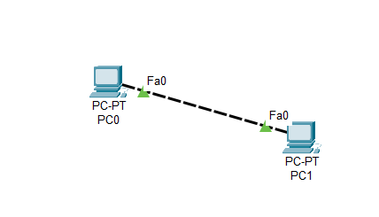
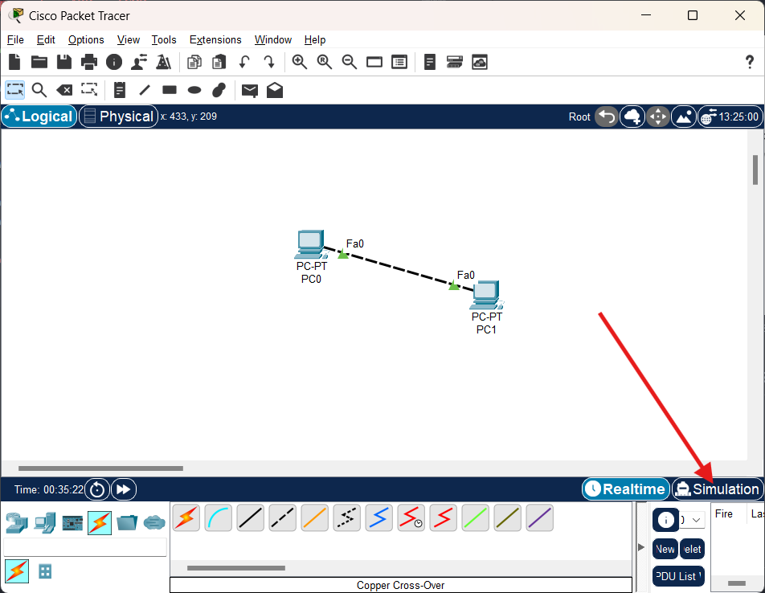
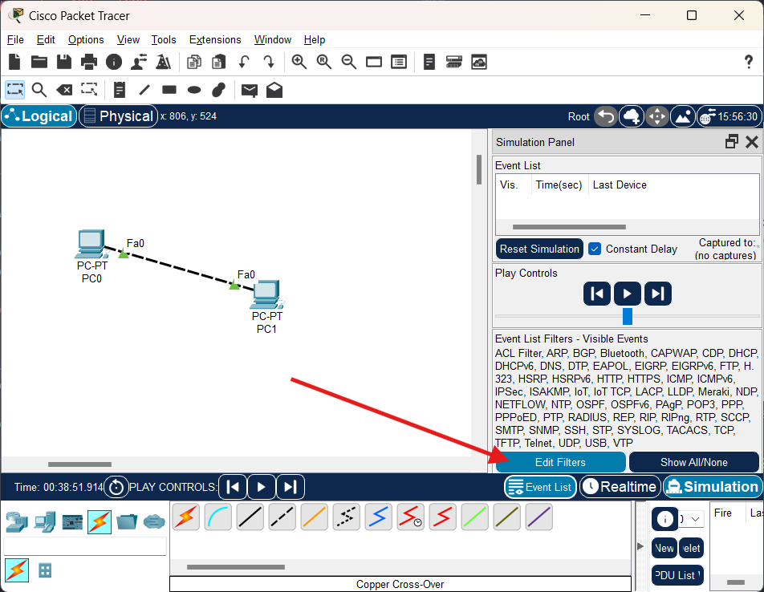
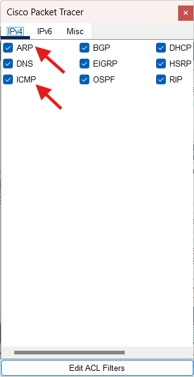
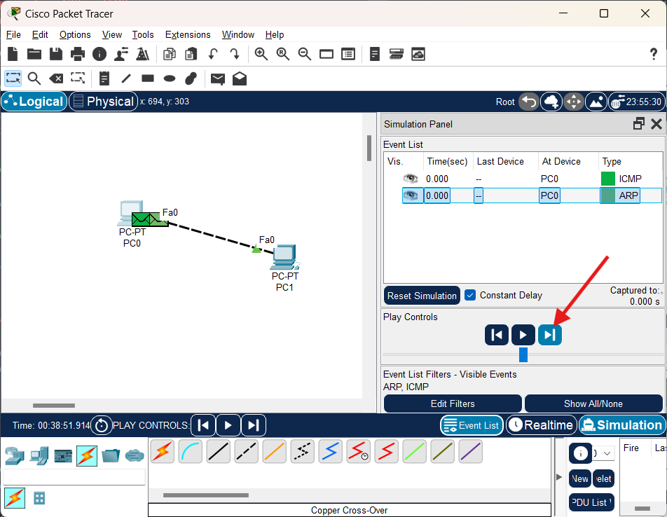
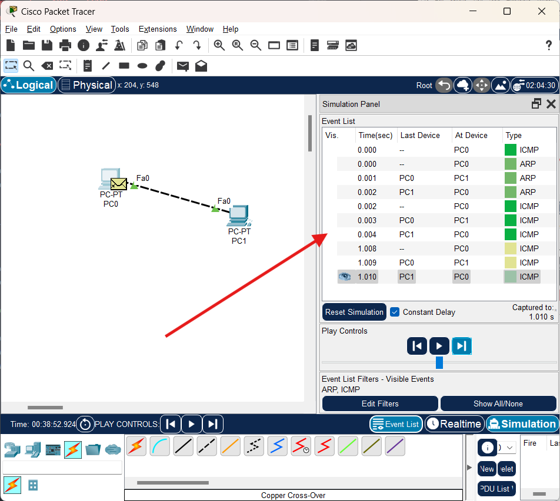
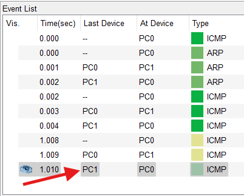
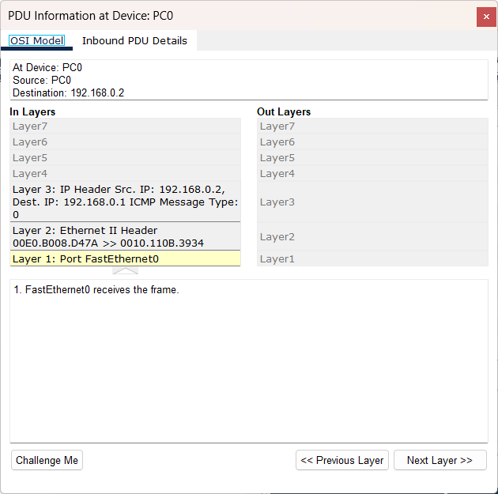

# Captura de paquetes ARP e ICMP

Para el ejemplo se conectan físicamente dos computadoras utilizando un cable Cross-Over



Luego se establecen IP estáticas para cada PC

## Configuración de IPs

| PC  |     IP      |
|:---:|:-----------:|
| PC0 | 192.168.0.1 |
| PC1 | 192.168.0.2 |

## Modo Simulación

Se ingresa en el modo simulación presionando el botón `Simulation` situado en la parte inferior derecha de la pantalla, o con el atajo en el teclado `Shift + S`



Luego se presiona el botón de `Edit Filters` que mostrará los tipos de eventos que se desean visualizar en el modo simulación



Esto desplegará el siguiente menú



Se dejan activados (con el checkbox azul) únicamente los de interés. Para el ejemplo actual se dejan seleccionados `ARP` e `ICMP` y se desactivan los demás.

## Solicitud ARP y protocolo ICMP en modo simulacion

Desde el Command Prompt de cualquier PC se realiza un ping hacia la otra PC. Para este ejemplo se selecciona el PC0 y se realiza el ping hacia la PC1.

En la simulación se visualizará paso por paso el proceso de la solicitud ARP y el protocolo ICMP.

Se puede ir de paso en paso presionando el botón `Siguiente` que se encuentra en la parte simulada, para ir avanzando en cada paso.



Al ir avanzando, se mostrará en la sección de `Even List` todos los eventos que han generado el proceso de la solicitud ARP y el protocolo ICMP.



Ya que la PC la primera vez que realiza el ping, no conoce la dirección física del dispositivo al cual quiere llegar, primero se crea una trama cuyo destino es la dirección IP de broadcast donde se incluye la dirección de destino a la que se desea localizar y luego, al reolver y almacenar su ubicación, continúa con el protocolo ICMP para continuar con los mensajes de control.

Si se desea obtener mayor información de la trama, se puede seleccionar cualquier item que se encuentra en esta lista de `Even List` (dando click en él) y obtener más información de dicho evento.



Al seleccionar el ítem se muestra información detallada del evento.



## Comandos Básicos en PC

```
# Mostrar la tabla ARP (dispositivos ya almacenados)
arp -a

# Eliminar todos los dispositivos en tabla ARP
arp -d
```