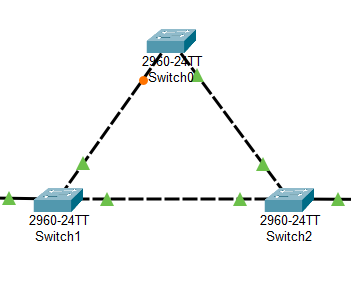
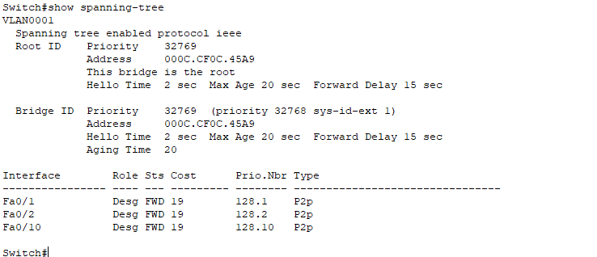

# Spanning Tree Protocol (STP)

## Gráfico completo

En la siguiente imágen se muestra una red totalmente enmallada



En un árbol de expansión (Spanning Tree) no se conectan totas las conexiones posibles sino solo las necesarias para que todo esté comunicado, evitando ciclos.

Para verificar la configuración del protocolo STP en cualquiera de los switches, se debe de ingresar en el modo de ejecución privilegiada y se utiliza el comando

```bash
show spanning-tree
```
Lo que mostrará algo similar a la siguiente configuración



En la anterior captura se puede ver el tipo de protocolo habilitado, en este caso `"protocol ieee"` equivale al spanning tree normal. Este protocolo se activa de manera predeterminada en los switches.

También se indica que la raíz está en el actual switch. Esto se puede visualizar con la línea `"This bridge is the root"`.

También el comando muestra un listado de interfaces, en el que se puede visualizar su rol (Role), estado (Sts) y costo (Cost). Esta información es importante al momento de poder describir el funcionamiento del STP.

Un rol `Root` implica que se trata de la conexión con el camino hacia el switch raíz.
Un rol `Desg` se trata de una conexión que si bien no es para la raíz, el algoritmo determinó que no representa un riesgo de loop y por lo tanto es el puerto que permite reenviar tráfico en un segmento de red.
Un rol `Altn` es el que se encuentra en modo de reserva. Este actúa como respaldo del Root Port. Cuando se encuentra en este modo entra en modo de bloqueo y entra en funcionamiento si el Root Port o el puerto designado fallan.

La parte más importante es el estado. Un puerto en estado `LIS` está escuchando y aprendiendo la topología de la red, un puerto en estado `FWD` va a permitir el paso de la información y por último un puerto en estado `BLK` no permitirá la transmisión de datos.

## Comandos importantes

Para ver un poco más de detalle se puede utilizar el comando

```bash
show spanning-tree detail
```

También se pueden visualizar los puertos que se encuentran bloqueados con el comando

```bash
show spanning-tree blockedports
```

## Variantes de STP

Para configurar una variante del protocolo de árbol de expansión se pueden utilizar los siguientes comandos en el modo de configuración global

```bash
# Modo Per-Vlan Spanning Tree
spanning-tree mode pvst
# Modo Per-Vlan Rapid Spanning Tree
spanning-tree mode rapid-pvst
```

Este modo debe de estar configurado en todo el gráfico completo, es decir, en todos los switches que participan en el protocolo.

## Configuración de protocolo STP (Root)

Para configurar el modo "root" del dispositivo se hace a través del comando

```bash
spanning-tree vlan <vlan o lista de vlans> root primary
```

A los demás switches se debe de colocar el mismo comando a excepción de `root primary` ya que esta parte solo es para el switch root. El comando quedaría de esta manera para los demás dispositivos

```bash
spanning-tree vlan <vlan o lista de vlans>
```
