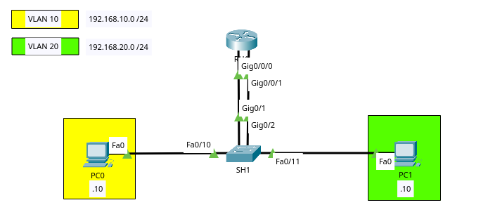
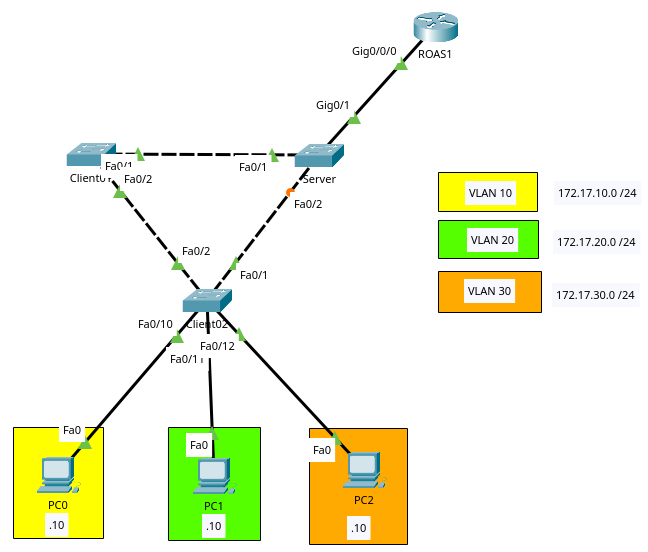
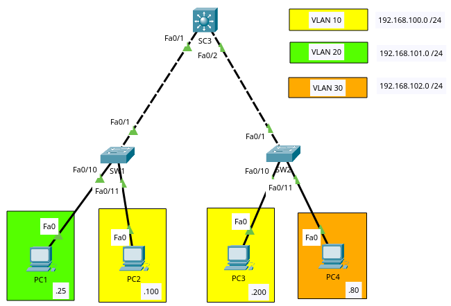

# Enrutamiento InterVLAN

## InterVLAN Routing Heredado



```bash
# SWITCH SH1
enable
configure terminal
  hostname SH1
  vlan 0
    exit
  vlan 20
    exit
  # Se da el acceso y se asigna vlan a cada dispositivo final
  interface FastEthernet 0/10
    switchport mode access
    switchport access vlan 10
    exit
  interface FastEthernet 0/11
    switchport mode access
    switchport access vlan 20
    exit
  # Se da el acceso y se asigna vlan a cada interfaz del router
  interface GigabitEthernet 0/1
    switchport mode access
    switchport access vlan 10
    exit
  interface GigabitEthernet 0/2
    switchport mode access
    switchport access vlan 20
    exit
  exit


# ROUTER RH1
enable
configure terminal
  hostname RH1
  # Se asigna la ip (gateway de cada red) en cada interfaz y se encienden
  interface GigabitEthernet 0/0/0
    ip address 192.168.10.1 255.255.255.0
    no shutdown
    exit
  interface GigabitEthernet 0/0/1
    ip address 192.168.20.1 255.255.255.0
    no shutdown
    exit
  exit
```

## Routing-on-a-stick



```bash
# SWITCH erver
enable
configure terminal
  hostname Server
  vlan 10
    exit
  vlan 20
    exit
  vlan 30
    exit
  vtp version 2
  vtp mode server
  vtp domain roas
  vtp password cisco
  interface range FastEthernet 0/1-2
    switchport mode trunk
    exit
  interface GigabitEthernet 0/1
    switchport mode trunk
    exit
  exit

# Switch Client01
enable
configure terminal
  hostname Client01
  vtp version 2
  vtp mode client
  vtp domain roas
  vtp password cisco
  interface range FastEthernet 0/1-2
    switchport mode trunk
    exit
  exit


# Switch Client02
enable
configure terminal
  hostname Client02
  vtp version 2
  vtp mode client
  vtp domain roas
  vtp password cisco
  interface range FastEthernet 0/1-2
    switchport mode trunk
    exit
  interface FastEthernet 0/10
    switchport mode access
    switchport access vlan 10
    exit
  interface FastEthernet 0/11
    switchport mode access
    switchport access vlan 20
    exit
  interface FastEthernet 0/12
    switchport mode access
    switchport access vlan 30
    exit
  exit

# Router ROAS1
enable
configure terminal
  hostname ROAS1
  # Se enciende la interfaz que estará activa para el tráfico de VLANs
  interface GigabitEthernet 0/0/0
    no shutdown
    exit
  # Se realizan las subinterfaces por cada vlan
  interface GigabitEthernet 0/0/0.10 # [interfaz].[vlan]
    encapsulation dot1Q 10 # Se indica con qué vlan trabajará dicha interfaz, en este caso 10
    ip address 172.17.10.1 255.255.255.0
    exit
  interface GigabitEthernet 0/0/0.20
    encapsulation dot1Q 20 # Se indica con qué vlan trabajará dicha interfaz, en este caso 20
    ip address 172.17.20.1 255.255.255.0
    exit
  interface GigabitEthernet 0/0/0.30
    encapsulation dot1Q 30 # Se indica con qué vlan trabajará dicha interfaz, en este caso 30
    ip address 172.17.30.1 255.255.255.0
    exit
  exit
```

## Switch de Capa 3 con interfaces virtuales (SVIs)



```bash
# Switch SW1
enable
configure terminal
  hostname SW1
  vlan 10
    exit
  vlan 20
    exit
  interface FastEthernet 0/1
    switchport mode trunk
    exit
  interface FastEthernet 0/10
    switchport mode access
    switchport access vlan 20
    exit
  interface FastEthernet 0/11
    switchport mode access
    switchport access vlan 10
    exit
  exit

# Switch SW2
enable
configure terminal
  hostname SW2
  vlan 10
    exit
  vlan 30
    exit
  interface FastEthernet 0/1
    switchport mode trunk
    exit
  interface FastEthernet 0/10
    switchport mode access
    switchport access vlan 10
    exit
  interface FastEthernet 0/11
    switchport mode access
    switchport access vlan 30
    exit
  exit


# Switch SC3
enable
configure terminal
  # Se indica al switch que actuará como enrutador
  ip routing # Este comando es muy importante. No sean como el aux y se les vaya a olvidar colocarlo
  hostname SC3
  # Se deben de crear todas las VLAN
  vlan 10
    exit
  vlan 20
    exit
  vlan 30
    exit
  # Se establecen los enlaces en modo troncal
  interface range FastEthernet 0/1-2
    switchport trunk encapsulation dot1q # Este switch si utiliza este comando
    switchport mode trunk
  # A cada interfaz vlan se le creará la ip que funcionará como gateway
  interface vlan 10
    ip address 192.168.100.1 255.255.255.0
    exit
  interface vlan 20
    ip address 192.168.101.1 255.255.255.0
    exit
  interface vlan 30
    ip address 192.168.102.1 255.255.255.0
    exit
  exit
```