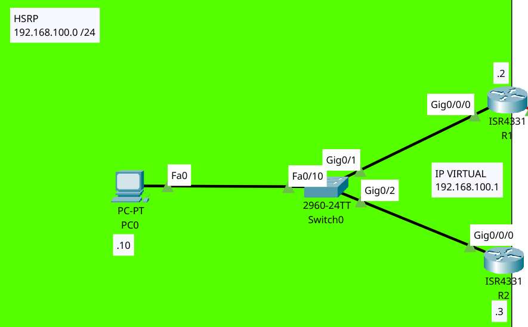

# Protocolos de Redundancia de Puerta de Enlace (default gateway)



```bash
# ROUTER R1
enable 
configure terminal
hostname R1
# Se debe de colocar siempre una IP a la interfaz
interface GigabitEthernet 0/0/0
ip address 192.168.100.2 255.255.255.0
no shutdown # Se enciende la interfaz
# Protocolo standby que se refiere a HSRP
# Se coloca el comando standby luego un número de grupo (debe ser igual para todos y luego la IP virtual)
standby 1 ip 192.168.100.1 # Con la IP Virtual
standby version 2 # Se coloca la versión de HSRP
standby 1 priority 110 # Prioridad será 100 por defecto. El más alto es el master
# El siguiente comando servira para controlar si un router en espera pueda pasar a tomar el control
standby 1 preempt # Se le puede colocar delay pero se deja asi
exit

# ROUTER R2
enable 
configure terminal
hostname R2
interface GigabitEthernet 0/0/0
ip address 192.168.100.3 255.255.255.0
no shutdown
standby 1 ip 192.168.100.1 # Con el mismo número de grupo y la misma IP Virtual
standby version 2 # El número de versión será 2 para todos
standby 1 priority 110 # Este comando se puede obviar si se pretende dejar con 100 por defecto
standby 1 preempt
exit
```

Video de referencia

[](https://www.youtube.com/watch?v=EHhmAvLVNjs)